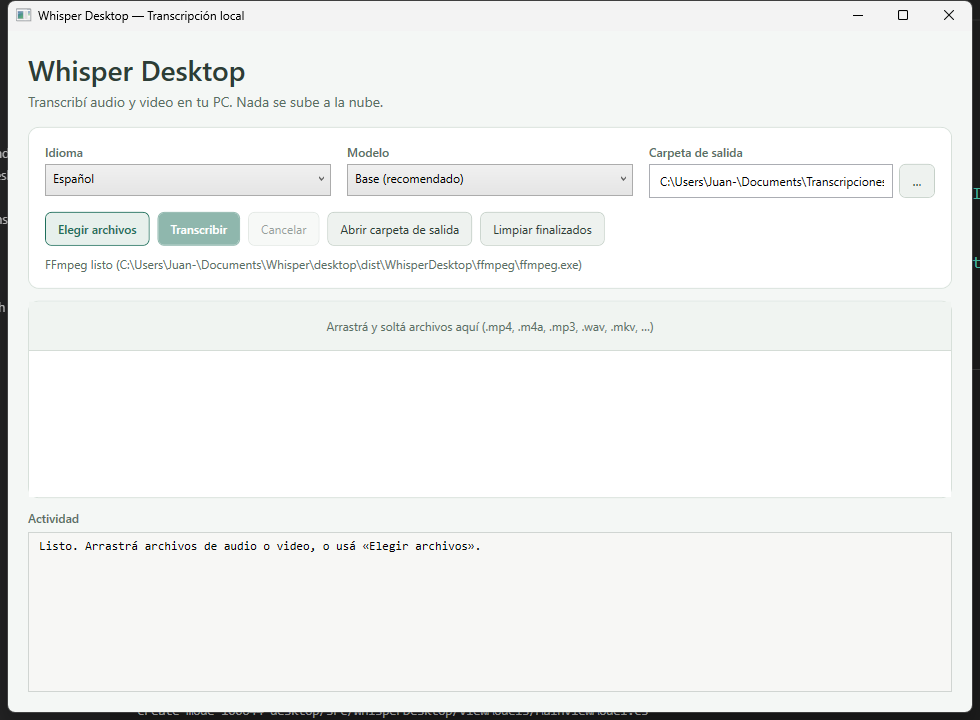
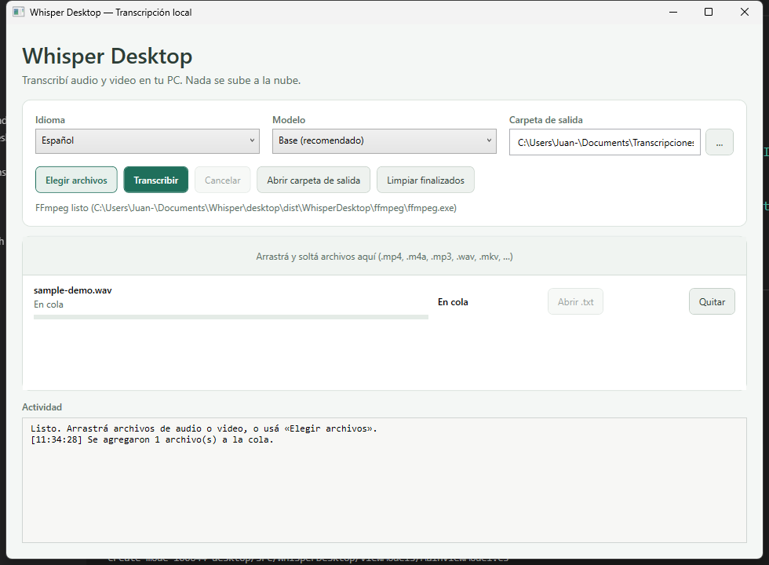

# Whisper Transcriber

Transcripción **local** de audio y video con [OpenAI Whisper](https://github.com/openai/whisper).  
Tu contenido **no se sube a la nube**: todo corre en tu PC.

| Opción | Para quién |
|--------|------------|
| **[App Windows (MSI)](#descargar-e-instalar-windows)** | Usuarios finales — instalar y usar con interfaz gráfica |
| **[Docker](#uso-con-docker)** | Quienes prefieren línea de comandos / servidores |
| **[Desarrollo .NET](#desarrollo-net)** | Quienes quieren compilar o contribuir |

**Licencia:** [MIT](LICENSE)

---

## Índice

1. [Descargar e instalar (Windows)](#descargar-e-instalar-windows)
2. [Cómo usar la app](#cómo-usar-la-app)
3. [Formatos soportados](#formatos-soportados)
4. [Idioma y modelo](#idioma-y-modelo)
5. [Dónde se guardan los archivos](#dónde-se-guardan-los-archivos)
6. [Estados de la transcripción](#estados-de-la-transcripción)
7. [Consejos de uso](#consejos-de-uso)
8. [Problemas frecuentes](#problemas-frecuentes)
9. [Uso con Docker](#uso-con-docker)
10. [Desarrollo (.NET)](#desarrollo-net)
11. [Estructura del repositorio](#estructura-del-repositorio)
12. [Privacidad](#privacidad)

---

## Descargar e instalar (Windows)

[](https://github.com/Juaandress/whisper-transcriber/releases/latest/download/WhisperDesktop-Setup.msi)

**[⬇️ Descargar WhisperDesktop-Setup.msi](https://github.com/Juaandress/whisper-transcriber/releases/latest/download/WhisperDesktop-Setup.msi)**

### Requisitos

- Windows 10 u 11 (64 bits)
- Unos **2–4 GB** libres en disco (modelo + archivos temporales)
- Internet **solo la primera vez** (para bajar el modelo de Whisper)

### Instalación

1. Descargá el archivo `WhisperDesktop-Setup.msi` desde el enlace de arriba (o desde [Releases](https://github.com/Juaandress/whisper-transcriber/releases)).
2. Abrilo con doble clic.
3. Seguí el asistente:
   - Podés marcar o desmarcar **Crear acceso directo en el escritorio** (viene marcado).
   - Al final, dejá marcado **Abrir Whisper Desktop** para que se inicie al terminar.
4. Si no lo abriste al final, buscá **Whisper Desktop** en el menú Inicio o en el escritorio.

Para desinstalar: *Configuración → Aplicaciones → Whisper Desktop → Desinstalar*.

> El MSI se publica en GitHub Releases. No hace falta clonar el repositorio si solo querés usar la app.



---

## Cómo usar la app

### Vista general

Pantalla principal al abrir la aplicación:


Archivo agregado a la cola, listo para transcribir:



### Pasos básicos

1. Abrí **Whisper Desktop**.
2. Arrastrá uno o más archivos a la ventana **o** tocá **Elegir archivos**.
3. Revisá las opciones:
   - **Idioma** — por defecto `Español` (recomendado si el audio está en español).
   - **Modelo** — por defecto `Base` (buen equilibrio velocidad/calidad).
   - **Carpeta de salida** — dónde se guardarán los `.txt` (por defecto: `Documentos\Transcripciones`).
4. Tocá **Transcribir**.
5. Esperá: vas a ver el progreso de cada archivo en la lista.
6. Cuando diga **Listo**, tocá **Abrir .txt** o **Abrir carpeta de salida**.

Podés agregar varios archivos a la cola: se procesan uno tras otro.

### Botones de la interfaz

| Botón | Qué hace |
|-------|----------|
| **Elegir archivos** | Abre el explorador para seleccionar audio/video |
| **Transcribir** | Inicia la cola de trabajos pendientes |
| **Cancelar** | Detiene el proceso en curso |
| **Abrir carpeta de salida** | Abre la carpeta donde están los `.txt` |
| **Limpiar finalizados** | Saca de la lista los trabajos listos o con error |
| **Abrir .txt** | Abre la transcripción de ese archivo |
| **Quitar** | Elimina un ítem de la cola (si no está procesándose) |

### Ejemplo

Si transcribís `reunion.m4a`, al terminar vas a tener algo como:

`Documentos\Transcripciones\reunion.txt`

con el texto de lo que se escuchó en el audio.

---

## Formatos soportados

| Tipo | Extensiones |
|------|-------------|
| Video | `.mp4` `.mkv` `.mov` `.avi` `.webm` |
| Audio | `.m4a` `.mp3` `.wav` `.flac` `.ogg` `.aac` |

La app convierte el audio internamente (con FFmpeg) a WAV 16 kHz mono, que es lo que Whisper necesita. No tenés que convertir el archivo a mano.

---

## Idioma y modelo

### Idioma

| Opción | Cuándo usarla |
|--------|----------------|
| **Español** | Audio en español (mejor precisión) |
| **Detectar automáticamente** | No estás seguro del idioma |
| Inglés / Portugués / Francés / Italiano | Si el audio está en ese idioma |

Forzar el idioma correcto suele dar mejores resultados que la detección automática.

### Modelo

Todos los modelos son **gratis y privados** (corren en tu PC). La app muestra tamaño, velocidad y calidad para que elijas:

| Modelo | Descarga aprox. | Velocidad | Calidad |
|--------|-----------------|-----------|---------|
| **Tiny** | ~75 MB | Muy rápida | Básica |
| **Base** (recomendado) | ~140 MB | Rápida | Buena |
| **Small** | ~460 MB | Moderada | Muy buena |
| **Medium** | ~1,5 GB | Lenta | Alta |
| **Large v2 / v3** | ~3 GB | Muy lenta | Máxima |
| **Large v3 Turbo** | ~1,6 GB | Media-alta | Muy alta |

Cuanto más grande el modelo, mejor suele ser el texto, pero:
- la **primera vez** descarga más datos,
- la transcripción en CPU **tarda más**,
- necesitás más espacio en disco (y RAM en los Large).

La primera vez que uses un modelo, la app lo descarga y lo deja en:

`%LocalAppData%\WhisperDesktop\models\`

Después no hace falta volver a bajarlo.
---

## Dónde se guardan los archivos

| Qué | Dónde |
|-----|--------|
| Transcripciones (`.txt`) | Por defecto `Documentos\Transcripciones` (o la carpeta que elijas) |
| Modelos de Whisper | `%LocalAppData%\WhisperDesktop\models\` |
| Temporales (WAV intermedios) | `%LocalAppData%\WhisperDesktop\temp\` (se borran solos) |

El nombre del `.txt` es el mismo que el archivo original, cambiando la extensión.  
Ejemplo: `entrevista.mp4` → `entrevista.txt`.

---

## Estados de la transcripción

En la lista de trabajos vas a ver estados como:

| Estado | Significado |
|--------|-------------|
| **En cola** | Esperando a ser procesado |
| **Convirtiendo audio** | FFmpeg está extrayendo/convirtiendo el audio |
| **Descargando modelo** | Primera vez (o modelo nuevo): bajando Whisper |
| **Transcribiendo** | Whisper está generando el texto (con % si puede) |
| **Listo** | Terminado; ya podés abrir el `.txt` |
| **Error** | Falló; el mensaje indica el motivo |
| **Cancelado** | Lo detuviste con **Cancelar** |

Abajo hay un panel de **Actividad** con un registro breve de lo que va pasando.

---

## Consejos de uso

- Preferí audio lo más limpio posible (menos ruido de fondo = mejor texto).
- Si el audio es en español, dejá el idioma en **Español**.
- Para una prueba rápida usá **Tiny**; para uso serio, **Base** o **Small**.
- Podés dejar la PC trabajando: la app no necesita que mires la pantalla.
- Si un archivo falla, revisá que no esté corrupto y que la extensión esté en la lista soportada.

---

## Problemas frecuentes

**“No se encontró FFmpeg”**  
En la versión instalada con MSI, FFmpeg debería venir incluido. Si aparece el error, reinstalá desde el [último release](https://github.com/Juaandress/whisper-transcriber/releases/latest). Si compilás desde el código, ejecutá antes `desktop\tools\publish.ps1`.

**La primera transcripción tarda mucho**  
Está descargando el modelo (~140 MB con Base). Las siguientes son más rápidas.

**El texto tiene errores / palabras inventadas**  
Probá el modelo **Small**, forzá el idioma correcto, o mejorá la calidad del audio. Whisper no es perfecto, sobre todo con nombres propios o jerga.

**Windows bloquea el instalador**  
Es normal en software no firmado con certificado de código. Elegí “Más información” → “Ejecutar de todas formas”, o desbloqueá el archivo en Propiedades.

**Quiero borrar los modelos para liberar espacio**  
Borrá la carpeta `%LocalAppData%\WhisperDesktop\models\`. La próxima vez se vuelven a descargar.

---

## Uso con Docker

Sirve si preferís no instalar la app y ya tenés Docker.

### Requisitos

- [Docker Desktop](https://docs.docker.com/get-docker/) (o Docker Engine)

### Pasos

```powershell
git clone https://github.com/Juaandress/whisper-transcriber.git
cd whisper-transcriber
mkdir videos, transcriptions
```

1. Copiá tus archivos de audio/video a la carpeta `videos\`.
2. Construí la imagen:

```powershell
docker build -t whisper-transcriber .
```

3. Ejecutá la transcripción:

**Windows (PowerShell):**

```powershell
docker run --rm `
  -v "${PWD}\videos:/app/videos" `
  -v "${PWD}\transcriptions:/app/transcriptions" `
  whisper-transcriber
```

**macOS / Linux:**

```bash
docker run --rm \
  -v "$(pwd)/videos:/app/videos" \
  -v "$(pwd)/transcriptions:/app/transcriptions" \
  whisper-transcriber
```

4. Los `.txt` aparecen en `transcriptions\` con el mismo nombre base del archivo.

### Configuración Docker

En [`entrypoint.sh`](entrypoint.sh):

| Parámetro | Valor por defecto | Cómo cambiarlo |
|-----------|-------------------|----------------|
| Modelo | `base` | Cambiá `--model base` por `tiny`, `small`, `medium` o `large` |
| Idioma | `es` (español) | Cambiá `--language es` o sacalo para detección automática |

Luego volvé a construir la imagen: `docker build -t whisper-transcriber .`

### Formatos en Docker

Los mismos que la app: video `.mp4` `.mkv` `.mov` `.avi` `.webm` y audio `.m4a` `.mp3` `.wav` `.flac` `.ogg` `.aac`.

---

## Desarrollo (.NET)

Stack de la app de escritorio:

- .NET 8 / WPF
- [Whisper.net](https://github.com/sandrohanea/whisper.net) (whisper.cpp)
- FFmpeg embebido
- Instalador con [WiX Toolset](https://wixtoolset.org/) 5

### Requisitos para compilar

- [.NET 8 SDK](https://dotnet.microsoft.com/download/dotnet/8.0)
- WiX CLI 5: `dotnet tool install --global wix --version 5.0.2`

### Ejecutar en desarrollo

```powershell
cd desktop
dotnet run --project src\WhisperDesktop\WhisperDesktop.csproj
```

La primera vez conviene correr `.\tools\publish.ps1` para dejar FFmpeg en `tools\ffmpeg\`, o tener `ffmpeg` en el PATH.

### Publicar app + MSI

```powershell
cd desktop\tools
.\publish.ps1 -Version 1.0.0
```

Salida:

- `desktop\dist\WhisperDesktop\` — carpeta portable
- `desktop\dist\WhisperDesktop-Setup.msi` — instalador

### Crear una release en GitHub

```powershell
gh release create v1.0.0 desktop\dist\WhisperDesktop-Setup.msi `
  --title "Whisper Desktop v1.0.0" `
  --notes "Instalador Windows (MSI)."
```

O etiquetar y pushear (el workflow [`.github/workflows/release.yml`](.github/workflows/release.yml) arma el MSI):

```powershell
git tag v1.0.0
git push origin v1.0.0
```

---

## Estructura del repositorio

```
whisper-transcriber/
├── dockerfile                 # Imagen Docker
├── entrypoint.sh              # Script de transcripción en el contenedor
├── docs/images/               # Capturas de pantalla para el README
├── desktop/
│   ├── src/WhisperDesktop/    # App WPF (.NET 8)
│   ├── installer/Package.wxs  # Definición del MSI (WiX)
│   └── tools/publish.ps1      # Publish self-contained + MSI
├── .github/workflows/release.yml
├── LICENSE
└── README.md
```

Las carpetas `videos/` y `transcriptions/` son solo locales (están en `.gitignore`).

---

## Privacidad

- El procesamiento es **100 % local**.
- Lo único que se descarga de internet es el **modelo** de Whisper la primera vez (desde Hugging Face / ggml oficial).
- No hay cuentas, API keys ni telemetría de la app.

---

## Licencia

MIT — ver [LICENSE](LICENSE).  
Whisper y whisper.cpp tienen sus propias licencias open source.
